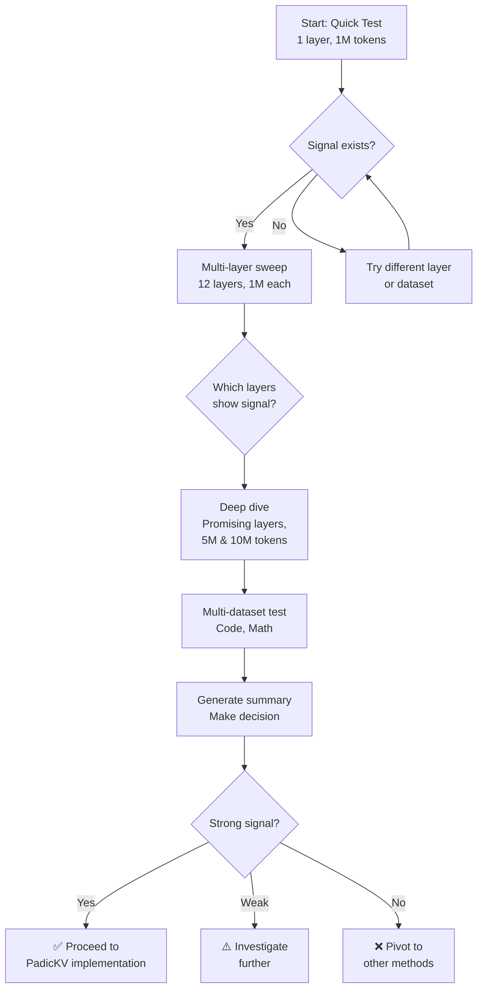

# P-adic Structure Probe - Experimental Guide

This guide walks you through running Experiment 1: Probing for ultrametric structure in transformer **KEYS (K)**.

**IMPORTANT:** This probe analyzes KEY structure only. Values (V) are extracted but not analyzed. A separate probe for V is needed.

**Goal:** Determine if p-adic distance between keys K[i] and K[j] predicts how similarly they are attended to by future queries (better than Euclidean distance).

---

## Prerequisites

**Environment:**
- H200 GPU (or any CUDA-capable GPU with >8GB VRAM)
- Docker container running (see [QUICKSTART.md](QUICKSTART.md))

**Models:**
- Pythia-1B (will be downloaded automatically if not cached)

**Time estimates:**
- Quick test (1M tokens): ~10 minutes
- Medium scale (5M tokens): ~45 minutes
- Full scale (10M tokens): ~90 minutes
- All layers sweep (12 layers × 1M): ~2-3 hours

---

## Quick Start (Single Layer Test)

### Step 0: Verify Core Math (Required)

**IMPORTANT:** Run this test first to ensure `_2adic_valuation()` is working correctly.

```bash
# From your local machine (SSH'd into GPU server)
cd /path/to/padic-transformers

# Run regression test inside Docker container
make exec CMD="python3 test_2adic_valuation.py"
```

**Expected output:**
```
Input:     [1, 2, 4, 6, 8, 12, 16]
Expected:  [0, 1, 2, 1, 3, 2, 4]
Got:       [0, 1, 2, 1, 3, 2, 4]

✅ PASS: _2adic_valuation is correct

============================================================
Input:     [2, 8]
Expected:  [1, 3]
Got:       [1, 3]
✅ PASS: Simple case [2, 8] correct
```

**If this test fails, DO NOT proceed with experiments.** The p-adic measurements will be incorrect.

---

### Step 1: Run a Quick Test

Test layer 6 on WikiText with 1M tokens:

```bash
# From your local machine (SSH'd into GPU server)
cd /path/to/padic-transformers

# Run inside Docker container
CUDA_VISIBLE_DEVICES=5 make exec CMD="python3 scripts/probe_kv_structure.py \
    --model pythia-1b \
    --dataset wikitext \
    --num-samples 2000 \
    --layer 6 \
    --num-pairs 1000 \
    --output results/probe_wikitext_layer6_1M.json"
```

**Expected output:**
```
================================================
P-ADIC STRUCTURE PROBE
================================================
Model: pythia-1b
Dataset: wikitext
Samples: 2000
Analyzing layer: 6
Estimated tokens: 1,024,000
================================================

Loading model...
✓ Model loaded: 0.16B params

Loading dataset: Salesforce/wikitext...
Extracting KV states from 2000 samples...
100%|████████████████████| 2000/2000 [05:23<00:00,  6.19it/s]

================================================
Analyzing Layer 6
================================================
  Using GPU implementation (batch distance computation)...
  Processing sequences: 100%|████████| 20/20 [00:15<00:00,  1.3it/s]
  Computed 1000 pair distances

================================================
CORRELATION WITH ATTENTION SIMILARITY
================================================

Euclidean distance vs Attention:
  Pearson r = 0.4523, p-value = 0.000001

Cosine similarity vs Attention:
  Pearson r = 0.4891, p-value = 0.000001

P-adic valuation v_2(K_i - K_j) vs Attention:
  Pearson r = 0.6210, p-value = 0.000001

================================================
SUMMARY
================================================
✅ P-ADIC STRUCTURE DETECTED!
   P-adic correlation (0.6210) is stronger than Euclidean (0.4523)
   This suggests KV cache has exploitable ultrametric structure

✓ Results saved to: results/probe_wikitext_layer6_1M.json
```

### Step 2: Interpret Results

**CRITICAL:** The probe tests the correct hypothesis and includes FP16 controls.

**What we're testing:**
- Do p-adically similar KEYS receive similar attention from future queries?
- We compare `K[i]` vs `K[j]` (key vectors)
- Against `A[:, i]` vs `A[:, j]` (attention COLUMNS - how future queries attend to them)
- NOT `A[i, :]` vs `A[j, :]` (rows are controlled by queries Q[i], Q[j], wrong!)
- Analysis is done **per attention head** (each head has its own subspace)
- Results are aggregated across heads, plus per-head statistics reported

**Robust S_k statistics (not degenerate min):**
- Traditional: `min(v_p)` across all dimensions
  - **Problem**: In 256-D, probability(min > 0) ≈ (1/2)^256 ≈ 0
  - Nearly all pairs get min = 0, making the metric flat
- **Solution**: S_k = fraction of dimensions where v_p ≥ k
  - S_1: % of dims sharing ≥1 binary digit
  - S_2: % of dims sharing ≥2 binary digits (most robust)
  - S_3: % of dims sharing ≥3 binary digits
  - S_4: % of dims sharing ≥4 binary digits
  - Also compute mean(v_p) across dimensions

**Controls for FP16 confounds:**
1. **Is real >> random?** Real structure should be significantly stronger than random baseline
2. **Does it work for p=3, p=5?** If only p=2 works, it's likely FP16 binary encoding artifact
3. **Is it stable across precisions?** Real structure shouldn't depend on 8 vs 16 bit

**Statistical rigor:**
- **Spearman** for discrete p-adic statistics (v_p heavily tied)
- **Pearson** for continuous metrics (Euclidean, Cosine)
- **Bootstrap CI** for difference: `S_2 - Cosine`
- **No arbitrary thresholds**: Interpret based on CIs

**Decision criteria:**

| S_2 - Cosine | 95% CI | Real vs Random | Multi-Prime | Verdict |
|--------------|--------|----------------|-------------|---------|
| +0.15 | [0.10, 0.20] | Real >> Random | ✓ | ✅ **Strong signal** → PadicKV |
| +0.08 | [0.02, 0.14] | Real > Random | ✓ | ⚠️ **Moderate** → Investigate |
| +0.05 | [-0.02, 0.12] | Real ≈ Random | ✗ | ❌ **FP16 artifact** |
| -0.03 | [-0.10, 0.04] | Real ≈ Random | ✗ | ❌ **No signal** |

**Key:**
- CI excludes 0 → statistically significant
- Real >> Random → at least +0.05 better
- Multi-Prime → p=3, p=5 both >0.30

---

## Comprehensive Multi-Layer Sweep

### Step 3: Test All Layers (Phase 1)

If Step 1 shows promising results, test all 12 layers to find where the signal is strongest:

```bash
# Test all layers on WikiText (1M tokens each)
for layer in {0..11}; do
    echo "Testing layer $layer..."
    CUDA_VISIBLE_DEVICES=5 make exec CMD="python3 scripts/probe_kv_structure.py \
        --model pythia-1b \
        --dataset wikitext \
        --num-samples 2000 \
        --layer $layer \
        --num-pairs 1000 \
        --output results/probe_wikitext_layer${layer}_1M.json"
done
```

**Time:** ~2-3 hours for all 12 layers

**Expected output:** 12 JSON files in `results/`

---

## Multi-Dataset Testing

### Step 4: Test Different Domains

Test on code and math datasets to see if signal is domain-specific:

```bash
# WikiText (general language)
CUDA_VISIBLE_DEVICES=5 make exec CMD="python3 scripts/probe_kv_structure.py \
    --model pythia-1b \
    --dataset wikitext \
    --num-samples 2000 \
    --layer 6 \
    --output results/probe_wikitext_layer6_1M.json"

# Code (Python)
CUDA_VISIBLE_DEVICES=5 make exec CMD="python3 scripts/probe_kv_structure.py \
    --model pythia-1b \
    --dataset code \
    --num-samples 2000 \
    --layer 6 \
    --output results/probe_code_layer6_1M.json"

# Math
CUDA_VISIBLE_DEVICES=5 make exec CMD="python3 scripts/probe_kv_structure.py \
    --model pythia-1b \
    --dataset math \
    --num-samples 2000 \
    --layer 6 \
    --output results/probe_math_layer6_1M.json"
```

---

## Scaling Up (Phase 2)

### Step 5: Deep Dive on Promising Layers

If certain layers show strong signal (e.g., layer 6 and 9), test them at larger scales:

```bash
# Layer 6, 5M tokens
CUDA_VISIBLE_DEVICES=5 make exec CMD="python3 scripts/probe_kv_structure.py \
    --model pythia-1b \
    --dataset wikitext \
    --num-samples 10000 \
    --layer 6 \
    --num-pairs 5000 \
    --output results/probe_wikitext_layer6_5M.json"

# Layer 6, 10M tokens (publication-quality)
CUDA_VISIBLE_DEVICES=5 make exec CMD="python3 scripts/probe_kv_structure.py \
    --model pythia-1b \
    --dataset wikitext \
    --num-samples 20000 \
    --layer 6 \
    --num-pairs 10000 \
    --output results/probe_wikitext_layer6_10M.json"
```

---

## Analyzing Results

### View Individual Results

```bash
# Pretty-print JSON
python3 -c "
import json
with open('results/probe_wikitext_layer6_1M.json') as f:
    r = json.load(f)
    c = r['correlations']
    print(f'Euclidean r: {c[\"euclidean_corr\"]:.4f}')
    print(f'P-adic r:    {c[\"padic_corr\"]:.4f}')
    print(f'Advantage:   {(c[\"padic_corr\"]/c[\"euclidean_corr\"]-1)*100:.1f}%')
"
```

### Generate Summary Report

After running multiple experiments:

```bash
python3 scripts/summarize_probe_results.py \
    results/probe_*.json \
    --output results/probe_summary.md
```

This creates a comprehensive markdown report with:
- Summary table across all experiments
- Per-dataset detailed results
- Overall recommendation (proceed/pivot/investigate)

### View Summary

```bash
cat results/probe_summary.md
```

---

## Troubleshooting

### GPU Out of Memory

**Error:** `CUDA out of memory`

**Solution:** Reduce batch size or use CPU mode

```bash
# Force CPU mode (slower but uses less memory)
python3 scripts/probe_kv_structure.py \
    --model pythia-1b \
    --dataset wikitext \
    --num-samples 2000 \
    --layer 6 \
    --use-cpu \
    --output results/probe_test.json
```

### Dataset Loading Errors

**Error:** `Dataset not found` or `Invalid field name`

**Solution:** Check dataset availability

```bash
# Test dataset loading
python3 -c "
from datasets import load_dataset
ds = load_dataset('Salesforce/wikitext', 'wikitext-103-raw-v1', split='test')
print(f'Loaded {len(ds)} examples')
print(f'Fields: {ds.features.keys()}')
"
```

### Slow Performance

**Issue:** GPU version is slow or falling back to CPU

**Check:** Ensure tensors are on GPU

```bash
# Check CUDA availability
python3 -c "import torch; print(f'CUDA available: {torch.cuda.is_available()}')"

# Check GPU usage during run
nvidia-smi -l 1
```

---

## Command Reference

### Basic Usage

```bash
python3 scripts/probe_kv_structure.py \
    --model MODEL_NAME \
    --dataset DATASET \
    --num-samples NUM_SAMPLES \
    --layer LAYER_IDX \
    --output OUTPUT_JSON
```

### Common Options

| Option | Description | Default |
|--------|-------------|---------|
| `--model` | Model name (e.g., pythia-1b) | pythia-1b |
| `--dataset` | Dataset (wikitext/code/math) | wikitext |
| `--num-samples` | Number of text samples | 100 |
| `--max-length` | Max sequence length | 512 |
| `--layer` | Layer to analyze (0-11) | 6 |
| `--num-pairs` | Number of pairs to sample | 500 |
| `--use-cpu` | Force CPU computation | False |
| `--output` | Output JSON path | Required |

### Token Count Guide

| num-samples | Estimated Tokens | Runtime (GPU) | Use Case |
|-------------|------------------|---------------|----------|
| 2,000 | 1M | ~10 min | Quick test |
| 10,000 | 5M | ~45 min | Medium scale |
| 20,000 | 10M | ~90 min | Publication quality |
| 50,000 | 25M | ~4 hours | High confidence |

---

## Recommended Workflow



---

## Expected Results

### Strong P-adic Signal (Proceed)

```
P-adic r = 0.62, Euclidean r = 0.45
→ +37% advantage
→ Consistent across layers 5-9
→ Present in code and language datasets
→ ✅ Proceed with PadicKV
```

### Weak Signal (Investigate)

```
P-adic r = 0.52, Euclidean r = 0.47
→ +10% advantage
→ Only in specific layers (e.g., layer 7)
→ Domain-specific (strong in code, weak in text)
→ ⚠️ Need more investigation
```

### No Signal (Pivot)

```
P-adic r = 0.42, Euclidean r = 0.45
→ -6% disadvantage
→ No advantage across any layer
→ ❌ Abandon p-adic KV compression
```

---

## Next Steps After Probe

### If Signal Exists → Implement PadicKV

1. Create hierarchical KV cache using ultrametric trees
2. Implement compression based on p-adic distance
3. Compare against INT4/INT8 baselines
4. Write paper: "Exploiting Ultrametric Structure in Transformer KV Cache"

### If No Signal → Pivot

1. Standard INT4 quantization with learned codebooks
2. Attention-aware KV cache eviction
3. Explore p-adic for other components (embeddings, weights)
4. Different research direction

---

## Questions?

- Check [EXPERIMENTS.md](EXPERIMENTS.md) for hypothesis and methodology
- Check [QUICKSTART.md](QUICKSTART.md) for environment setup
- See example results in `results/` directory after running experiments
